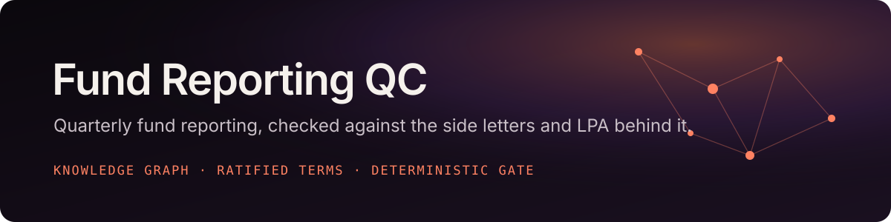
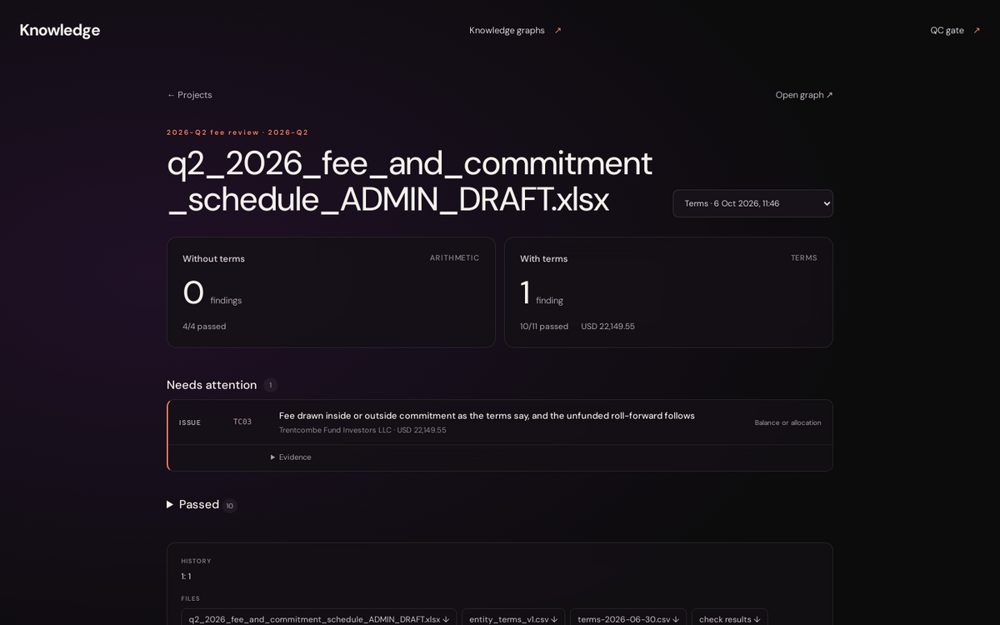
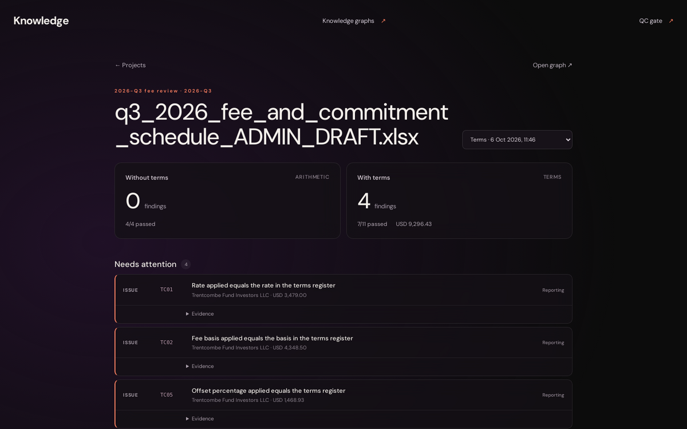
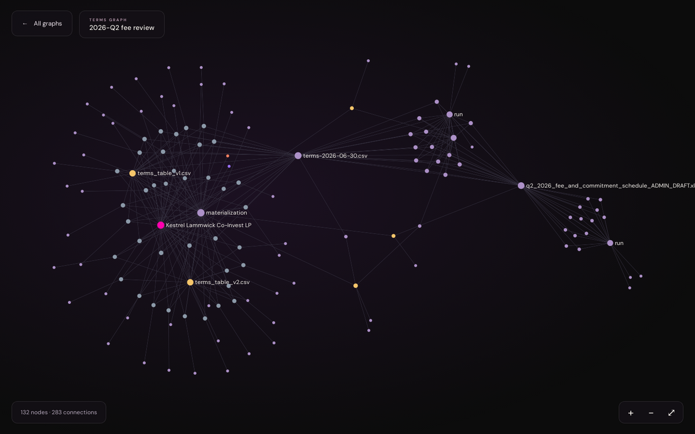
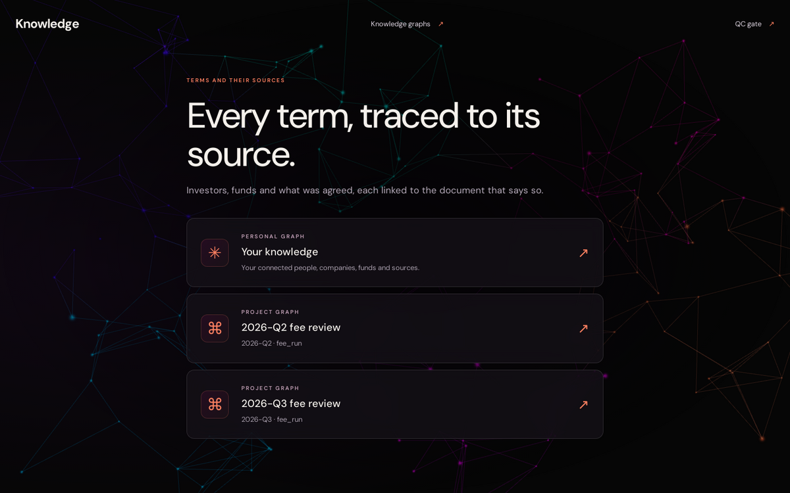
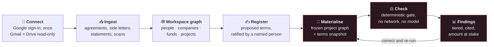
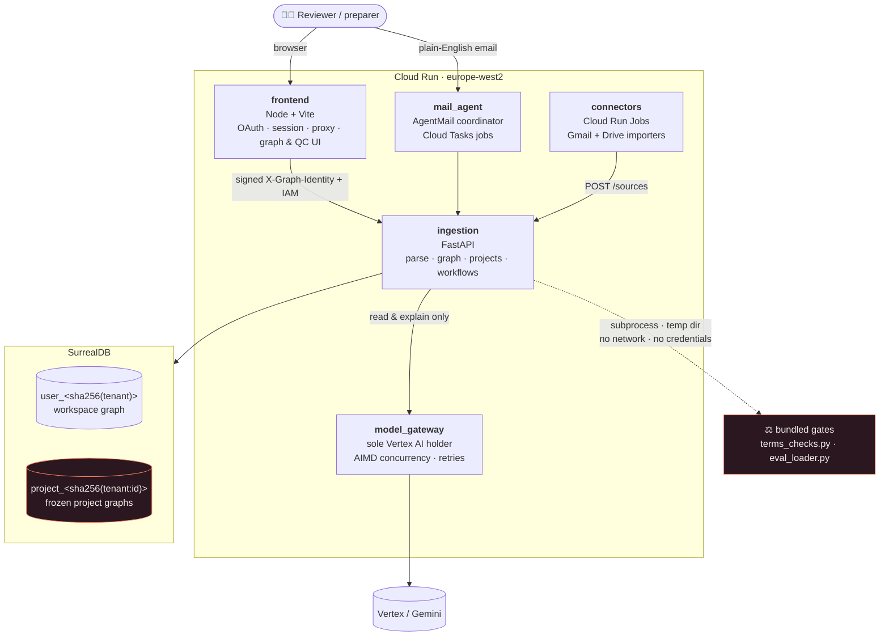

<div align="center">



<br>

[](services/ingestion/)
[](services/ingestion/app/main.py)
[](compose.yaml)
[](frontend/)
[](infrastructure/)
[](#the-checkers)
[](#the-checkers)

**Quarterly fund reporting, checked against the legal documents that govern it.**

[**▶ Watch the demo**](#-see-it-run) · [**Run it locally**](#run-locally) · [**Demo deck**](Brain_and_Gate_demo.pdf) · [**Contributing**](AGENTS.md)

</div>

---

Every quarter a fund administrator delivers a draft to the fund manager: financial
statements, a capital account schedule, a loader file. Someone has to decide whether it
can be accepted. This reads that draft, reads the partnership agreements and side
letters behind it, and returns a cited list of what is wrong, what is merely untidy,
and what nobody has decided yet.

**Who it is for.** The reviewer at the fund manager deciding whether to accept a
delivery. The preparer at the administrator checking their own work before it leaves.
Fund operations answering which entities made it across and for how much. The auditor
tracing a figure back to the clause it rests on. [More on each below](#who-its-for).

You work with it by email. It builds a knowledge graph from your Gmail and Drive, holds
a register of investor terms that a named person has ratified, and runs a deterministic
checker that no language model can overrule.

It exists because of one number: **review rounds to acceptance.** Today that number is
six or seven. The administrator is not careless and not slow — each round turns around
in a day or two. The cost is the iteration itself. And the defects cluster in exactly
one place: anything that requires reading a document *outside* the accounting ledger
and applying it — the partnership agreement, a side letter, last quarter's disclosures.
Mechanical processing is already sound. Contextual processing is not.

So the system reads the documents.

## ▶ Try it

The hosted environment has been taken down. [Run it locally](#run-locally) instead: `make up`
brings up the whole stack, and [Reproduce the demo](#reproduce-the-demo) seeds a signed-in
workspace from the partner fixtures.

**Or read the demo deck first: [Brain and Gate](Brain_and_Gate_demo.pdf)** (6 pages) —
the problem in fund managers' own words, the quarterly GL reporting workflow it plugs
into, the gate scored against 18,929 rows of real migration data, and a worked example
of one investor email changing the terms.

---

## ▶ See it run

<div align="center">

<a href="docs/media/demo.mp4"></a>

<sub><b><a href="docs/media/demo.mp4">Full-quality MP4</a></b> · the workspace and Q2 project knowledge graphs, recorded against the local stack (<code>make up</code>) using the Kestrel Lammwick partner fixtures. See <a href="#reproduce-the-demo">Reproduce the demo</a>.</sub>

</div>

One fund, two quarters, one investor's side letter. The administrator's arithmetic is
internally consistent in both drafts, so a footing check passes them. Read against the
ratified terms, both drafts are wrong:

| Draft | Without terms (arithmetic only) | With ratified terms | Amount at stake (tier a) | What it caught |
|---|:---:|:---:|---:|---|
| **Q2 2026** (`as_of` 30 Jun) | 0 findings · 4/4 passed | **1 finding** · 10/11 passed | **USD 22,149.55** | `TC03`: Trentcombe's fee was drawn *outside* commitment, but side letter clause 2(b) says *inside*, so unfunded commitment is overstated |
| **Q3 2026** (`as_of` 30 Sep) | 0 findings · 4/4 passed | **4 findings** · 7/11 passed | **USD 9,296.43** | `TC01` rate, `TC02` basis, `TC05` offset, `TC09` net fee. An amended side letter, effective 1 July, arrived by email later and the draft never picked it up |

The gap between those two columns is what the terms register adds. It is shown
side by side on the dashboard, not just claimed in this README.

<table>
<tr>
<td width="50%"><br><sub><b>QC dashboard, Q2.</b> Arithmetic alone and against the ratified terms, side by side</sub></td>
<td width="50%"><br><sub><b>QC dashboard, Q3.</b> The amended side letter applied from its effective date</sub></td>
</tr>
<tr>
<td width="50%"><br><sub><b>Project graph.</b> Copied evidence, the terms snapshot, ratifications and every run</sub></td>
<td width="50%"><br><sub><b>Two levels of graph.</b> Your live workspace, plus one frozen graph per project</sub></td>
</tr>
</table>

---

## What it actually does



| Step | What happens | Where |
|---|---|---|
| **Connect** | One Google consent for Gmail and Drive. Tokens go to a per-account secret and never reach the browser | [`frontend/server/auth.mjs`](frontend/server/auth.mjs) |
| **Ingest** | Connectors archive the originals, then ingestion parses them and builds the knowledge graph | [`services/connectors/`](services/connectors/), [`app/extraction.py`](services/ingestion/app/extraction.py) |
| **Register** | Terms are proposed from documents (*this investor's fee is X, from this date, per this clause*). Nothing unratified is ever used | [`app/term_proposals.py`](services/ingestion/app/term_proposals.py), [`app/terms.py`](services/ingestion/app/terms.py) |
| **Check** | The gate runs against the terms in force on the draft's date and returns a tiered, cited findings report | [`app/workflows.py`](services/ingestion/app/workflows.py), [`app/gates/`](services/ingestion/app/gates/) |
| **Loop** | Correct and re-run. Findings fall turn by turn, and the register is reused every quarter after | [`/dashboard`](#6-you-read-the-result-on-the-qc-dashboard) |

Two design commitments make it usable rather than merely clever:

**Nothing is guessed.** Every finding traces to a document and a location inside it.
Every term carries two dates — when it became true in the world, and when the system
learned it — so "the side letter arrived on the 6th but is effective from the 1st" is
a question the system can actually answer, for both quarters, correctly.

**The checker is deterministic.** No language model runs on the evaluation path. The
same draft and the same terms snapshot produce byte-identical findings, today and in
two years. Models are used to *read* documents and to *explain* results, never to
decide whether a number is right.

---

## Who it's for

| Person | What they use it for |
|---|---|
| **Reviewer** at the fund manager | Decide whether a delivered draft can be accepted, and what to send back |
| **Preparer** at the administrator | Check their own work before it leaves, and see which decisions they still owe |
| **Investor relations / fund ops** | Answer "which of my entities made it across, and how much money" |
| **Auditor** | Trace any figure back to the document and clause it rests on |

The preparer is the harder user and the more important one. A reviewer forgives a false
positive; a preparer who built the file dismisses the whole tool after two. That is why
passes are shown and never hidden, why a blank awaiting a decision is rendered
differently from an error, and why comparison tolerances are exact rather than
proportional.

---

## Two levels of graph

This trips people up, so it is worth being explicit. There are **two** graphs, and they
do different jobs.

**Your workspace graph** is everything your account knows: the people, companies, funds,
quarterly projects and documents found across your Gmail and Drive, and the links
between them. There is one per connected account, it is built automatically as soon as
you connect, and it is **alive** — every re-ingest adds to it, and identity resolution
merges duplicates into each other over time. It is what you explore at
`/graphs/workspace`, labelled *"Your knowledge"*. Use it to find things.

**A project graph** is one fund, one quarter, one job — and, crucially, not just the
evidence but **the work done on it**: the input manifests, the intermediate workbooks,
the terms snapshots, who ratified what, every run and every individual check result.
One is created on demand the first time a workflow runs on that project. It is
**frozen**: materialisation *copies* the selected sources in, and copied records and
artifacts are immutable ever after. You open it at `/graphs/<project-id>`.

| | Workspace graph | Project graph |
|---|---|---|
| Scope | Your whole account | One fund, one quarter |
| Created | Automatically, on ingest | On demand, by a workflow run |
| Changes over time | Yes — grows, merges duplicates | No — append-only, immutable copies |
| Holds | Entities, sources, edges | Copied evidence **plus** artifacts, ratifications, runs, check results |
| Answers | "What do I have?" | "What did we check, against what, and what did it say?" |

### The important part: a project graph is a copy, not a link

There are no cross-database record links. Original IDs are carried over as provenance
values, but the copied records are physically independent — so **changing your workspace
graph has no effect on an existing project graph until someone explicitly
re-materialises it.**

That is the entire reason for the split. A check result has to be reproducible years
later, which means its inputs must be frozen. If the checker read the live workspace
graph, re-running the same draft next month could quietly produce different findings —
and a finding you cannot reproduce is a finding you cannot defend to an auditor. The
separation also means a run touches exactly one project database and can never reach the
main graph, Gmail, Drive, or a model.

Scope is explicit for the same reason: materialisation copies the source IDs you
*select*, because filenames and proximity are not a reliable way to decide what belongs
to a quarter.

One convenience: a project is useful *before* it has a project database. Open one that
has never had a workflow run and the API falls back to computing that project's
neighbourhood out of your workspace graph — its fund, its management company, its
attached sources, and the entities those sources evidence. So you get a meaningful view
from day one; it simply becomes a real, frozen graph the first time a workflow runs.

---

## The experience, start to finish

### 1. You connect — one button, once

The frontend is a
single page with a single Google button. It asks for Gmail and Drive **read** access
together, in one consent screen, because one authorization covers every connector — you
are never sent back to Google a second time to add another integration. Partial consent
is rejected: you either grant both or nothing is stored.

Your tokens never touch the browser. They are written to a secret whose name is derived
from your verified email address, readable only by the importer that runs on your
behalf. There is no shared slot, so one person's connection cannot overwrite or reach
another's.

The moment the connection lands, two things happen at once:

- an **ingestion run** is queued for your account, and
- a **welcome email** is queued from your agent.

### 2. You watch your graph get built

You are dropped straight onto a live progress view — you don't have to go looking for it.
It shows:

- a **progress bar** that is honest. A provider only reaches its full share of the bar
  when it has genuinely finished; while running it asymptotically approaches that share
  and never touches it. The bar shows 100% only when the state is actually `completed`.
- a **per-provider row** for Google Drive and Gmail — status, items checked, and a
  breakdown of what happened to them: ingested, already up to date, archived, metadata
  only, shortcuts, failed.
- an **AGENT ACTIVITY log**, timestamped, one line per real change the backend reported.
  No invented steps, no fake "analysing…" filler.

When the graph is ready it says so and takes you to `/graphs`. When it finishes *without*
a ready graph — a connector failed, or there were no supported files — it says that
plainly and offers the partial view instead of rounding up to success.

### 3. You explore what it found

`/graphs` lists your workspace graph plus a graph for each project — the
[two levels described above](#two-levels-of-graph). Opening one gives a
full-viewport WebGL view — pan, zoom, fit, click a node to select it and highlight its
neighbours — of the people, companies, funds, documents and quarterly projects it
extracted, and the links between them.

Opening a project graph never creates or modifies it. The data behind the view carries
only node IDs, names, kinds and relationship metadata — no source text, no file bytes,
no credentials.

### 4. Meanwhile, the agent has already emailed you

This is the part that changes how the product feels. **You do not have to come back to
the website to use it.** The welcome email introduces your agent and explains that you
give it work by replying to that address — and that you never need to sign in to do so.

It tells you what is happening right now (it is reading your Drive and Gmail, and will
write again the moment the graph is ready), how it scopes work, the two kinds of job it
does, and how to phrase a request.

Then it emails you again when ingestion finishes — and it distinguishes the endings
rather than flattening them:

> *"Good news. Your files are ingested and your knowledge graph is built and ready to
> use. Drive and Gmail both finished, covering 412 items that were ingested or already
> up to date."*

versus *"the scans finished but found no supported files"*, versus *"I ingested 412
items, and some files or a connector did not complete, so your graph is not fully ready
— reply 'retry ingestion' and I will pick up where I left off."* It never tells you the
graph is ready when it isn't.

### 5. You work by replying in plain English

You scope work to a project — one fund, one quarter, one job — and usually the fund name
and quarter are all it needs to find the right one.

**The two kinds of work it does:**

**"Do a first run-through for Fund A, Q2 2026."** — for a deliverable that doesn't exist
yet. A production agent drafts it as a workbook and writes down the delivery rules it
inferred, quoting the source text behind each one. A second, independent agent reviews
that draft against the same evidence and lists what remains unresolved. You get the
workbook, the rules, and a straight account of what is missing. Where it cannot find a
number it says so rather than filling the gap with a plausible one.

**"Run QC for Fund A, Q2 2026."** — for a deliverable that already exists. A fixed,
version-pinned checker runs your loader file or terms schedule against the source data.
The agents around it choose the inputs and explain the outcome; **they have no power to
overrule a finding.** Terms checks additionally refuse to run until a named person has
ratified the terms snapshot. Afterwards you get a dashboard link.

**Everything else you can ask:**

| You write | It does |
|---|---|
| *"What did the QC gate find?"* / *"Why was that blocked?"* | Reads back what is on the record. Runs nothing again, materialises nothing |
| *"What is the management fee basis for Fund A?"* | Answers from that project's own documents and quotes the source. If they don't answer it, it says so |
| *"How is that task going?"* — add *"with logs"* | Live status and current phase while something runs; with logs, the phase-by-phase event stream |
| *"How is my ingestion going?"* / *"Retry ingestion"* | Progress, or a restart that reuses everything already done |
| *"Show me the graph for Fund A"* / *"show me my knowledge graph"* | A link — you'll need to be signed in to open it |

**What it sends you:** a start email before it dispatches work, a completion email after
— including when the result is *blocked* or *failed*, never only on success — the draft
workbook itself, a link to the QC dashboard, a link to a graph, or a cited answer to a
question. First-run workbooks are also dropped into a **`Private markets drafts`** folder
in your own Google Drive, using a scope that only ever grants access to files this
application itself created; it can never read anything already in your account.

**How it works underneath:** your reply reaches an AgentMail inbox. A coordinator model
turns it into a real function call — `trigger_qc_gate`, `trigger_first_run`,
`explain_run`, `answer_project_question`, `check_workflow_status`, `check_ingestion_status`,
`retry_ingestion`, or one of the link tools — and dispatches a separate job through Cloud
Tasks. Each running job keeps a durable trace in its own project database: timestamped
phase transitions, evidence and artifact counts, checker state, delivery state. That
trace is what a later *"status?"* reads, which is why asking for status never starts a
second run.

Four things help it help you: name the fund and the quarter; send one request per email
(ask for two workflows at once and it will ask you to pick); if it names a missing input,
send it and ask again; and if your intent is ambiguous it asks rather than guesses.

One more: if someone it already recognises from your documents emails it directly, it
files their message and attachments into your graph and refreshes whichever project it
relates to. You don't forward things twice.

### 6. You read the result on the QC dashboard

`/dashboard` is the main product surface. Pick a project and you get one run, with a
picker to switch between that project's runs:

- **Header**: the project and quarter, and the draft's filename.
- **Scoreboard**: findings, passes out of checks run, and the amount at stake, which is
  the tier a total only, because tier b findings are parts of the same money. Where both
  runs exist for the same draft bytes, it shows the pair side by side: **Without terms**
  (arithmetic only, no register) against **With terms** (checked against the ratified
  terms in force). The gap between those two columns *is* the value the register adds.
- **Needs attention**: `FAIL` and `WARN`, each tagged *Balance or allocation* (tier a),
  *Reporting* (tier b) or *Hygiene* (tier c), with the investor and amount.
  - **Decisions**: *not errors*. A blank the administrator must fill.
  - **Passed**: shown, not hidden.
  - **Not run**: skipped in this mode, never silently counted as passed.
- **Each finding expands** to its evidence: the values compared and the clause cited.
- **History**: findings per run for the same draft and mode (`1: 43 → 2: 11 → 3: 2`).
  Bringing that number down is the point of the product, so the page shows it.
- **Files**: download the exact inputs (draft, entity terms, terms snapshot), the
  findings JSON, the checker log, and a standalone Markdown report that still makes sense
  outside the system and can be attached to an email.
- **Run details**: run ID, start time, draft hash, and the terms file used.

A run that produced no checks never renders a scoreboard reading "0 errors caught" — it
gets the header and the reason it stopped.

---
---

# Technical implementation

## Architecture



| Service | Does |
|---|---|
| [`frontend/`](frontend/) | Vanilla JS + Vite UI, Three.js landing, Sigma.js/Graphology graph viewer, and a Node server owning the Google OAuth flow and the authenticated proxy to ingestion |
| [`services/ingestion/`](services/ingestion/) | Document parsing, the knowledge graph, per-project databases, workflow orchestration and the bundled deterministic checkers |
| [`services/connectors/`](services/connectors/) | Gmail and Drive importers, run as Cloud Run Jobs, archiving originals to private GCS |
| [`services/mail_agent/`](services/mail_agent/) | Email coordinator: Gemini function calls dispatch QC, first-run, explain and status jobs via Cloud Tasks |
| [`services/model_gateway/`](services/model_gateway/) | The only holder of Vertex AI permission. One warm instance, AIMD concurrency window, retries with jitter, stable prompt bytes for implicit caching |
| [`infrastructure/`](infrastructure/) | Terraform — the source of truth for production |

## Isolation — how the two graph levels are stored

Every graph is a separate SurrealDB database. With `GRAPH_MULTI_USER=true` (production),
the `projects` namespace holds both levels:

| Level | Database | Contents |
|---|---|---|
| Workspace | `user_<sha256(tenant)>` | That account's canonical entities, sources, source bytes, parsed documents and edges |
| Project | `project_<sha256(tenant + ':' + project_id)>` | One project's copied evidence, originals, intermediate files, decisions and runs |

The tenant is the connector ID derived from the verified account email, so an arbitrary
user field, header, URL or project ID cannot select someone else's database. Both Gmail
and Drive for one account populate the same workspace graph. Identical entity or project
keys in two users' graphs are separate records. Only the internal provisioner may create
databases; user-facing queries use database-scoped credentials.

Single-tenant deployments use the shared `markets/documents` database for the workspace
level instead. That one is bootstrapped by `startup.sh.tftpl` with a principal the
service does not hold, so its schema is a manual, bootstrap-level change — it is **not**
covered by [`migrations.py`](services/ingestion/app/migrations.py).

There are no cross-database record links. A checker run touches exactly one project
database and never queries the main graph, Gmail, Drive, or a model. Materialization
copies *explicitly selected* source IDs — not everything that looks related; filenames
and proximity are not reliable scope. Re-materializing adds new evidence versions;
existing copied records and artifacts stay immutable.

`GET /graph/views` lists the workspace plus one entry per project.
`GET /graph/views/<id>` resolves `workspace` against the account database and any other
ID against that project's database, falling back to a canonical source-scoped
neighbourhood when the project database does not exist yet
([`graph_api.py:93-127`](services/ingestion/app/graph_api.py#L93-L127)). Both return only
node IDs, names, kinds and relationship metadata — never source text, file bytes or
credentials.

## The checkers

Two gates are vendored under [`services/ingestion/app/gates/`](services/ingestion/app/gates/):

- **Terms / side letters** — fee and commitment schedule checks. Runs in `terms` mode
  or `arithmetic-only` mode; the pair is what the dashboard's "Without terms / With terms"
  comparison renders. Entity and quarter are resolved from the workbook itself and
  validated against the project. Comparison uses `rtol=0` — a relative tolerance would
  let a large balance hide a real monetary error.
- **Loader gate** — validates a candidate loader file against a source GL and a mapping
  workbook, preserving original row numbers into the intermediate workbooks.

They run as bundled trusted code in a subprocess, in a temp directory, with no network
and no credentials in the environment. Results use `PASS` / `FAIL` / `WARN` / `DECISION`
/ `SKIPPED`. `completed` means the evaluation finished — not that the draft passed.
Missing inputs, missing ratification or wrong scope produce a persisted `blocked` run;
execution failure produces `failed`. Neither is ever reported as a pass.

<details>
<summary><b>The terms gate, check by check</b> (<code>TC00</code>–<code>TC10</code>)</summary>

| Check | Tier | Mode | Asserts |
|---|:---:|---|---|
| `TC00` | a | terms | Every schedule investor has a register row in force on the as-of date (`DECISION` if not) |
| `TC01` | b | terms | Rate applied equals the rate in the terms register |
| `TC02` | b | terms | Fee basis applied (Commitment / Invested Capital) equals the register |
| `TC03` | a | terms | Fee drawn inside or outside commitment as the terms say, and the unfunded roll-forward follows |
| `TC04` | a | terms | Fee-exempt investors are charged nothing |
| `TC05` | b | terms | Offset percentage applied equals the register |
| `TC06` | a | both | Allocation share equals commitment share |
| `TC07` | b | both | Gross fee = basis amount × rate / 4 |
| `TC08` | b | both | Totals row foots to the column sums |
| `TC09` | a | terms | Net fee equals the fee recomputed from the register (headline overcharge) |
| `TC10` | a | both | Roll-forward foots: `called_end = start + calls + fee inside`, `unfunded = commitment − called` |

Tier **a** changes a balance, an allocation or the scope. Tier **b** changes a report line
or must be resolved before upload. In `arithmetic-only` mode the terms checks are
reported as `SKIPPED`, which is why the Q2 and Q3 "without terms" runs read 4/4.

</details>

Run IDs are derived from the project, input IDs, gate code, package versions, mode and
ratifications. An exact replay returns the existing run and does not increment the turn
counter. Concurrent claims use a transaction and a 20-minute lease; execution has a
10-minute subprocess timeout.

Scope note: this workflow layer implements the checker, project isolation, ratification
and the run record. The PRD's full bitemporal fact register, messaging loop and learning
loop are described in [PRD.MD](PRD.MD) but are **not** all implemented here — terms live
in source rows and immutable CSV snapshots, not a `fact` collection.

## Input formats

Gmail and Drive sources are pulled by dedicated Cloud Run Jobs, which archive original
files and Google-native exports (Docs/Sheets/Slides → DOCX/XLSX/PPTX) in private GCS
buckets before handing supported files to the ingestion service. See
[connector provisioning](infrastructure/CONNECTORS.md).

- Reports and contracts: PDF, DOC, DOCX, ODT, RTF
- Presentations: PPT, PPTX
- Financial data: XLS, XLSX, CSV, TSV
- Correspondence: EML, MSG
- Web/text: HTML, TXT, Markdown, RST, XML, EPUB
- Scans: PNG, JPEG, TIFF, BMP, HEIC, and image-only PDFs with English OCR

`GET /formats` returns the exact allowlist. Legacy Office formats go through
LibreOffice; document conversions through Pandoc. Uploads are capped at 20 MiB,
expanded Office/EPUB containers at 100 MiB, extracted text at one million characters.
Requests are synchronous under the 15-minute cloud timeout — retry the same document
after a timeout or 503. Audio, video, generic ZIPs and email attachments are not
handled by the upload endpoint; the Gmail connector ingests MIME attachments
automatically.

For PDFs, `pdf_strategy=auto` extracts embedded text and falls back to OCR when none is
found. Use `ocr_only` for mixed text/scanned PDFs, or `hi_res` for layout-sensitive
extraction such as tables — it downloads its layout model on first use and is slower.
Spreadsheet formulas are not recalculated; extraction uses stored workbook content.

## Run locally

Everything except the mail agent runs on your machine. Use it — do not test in production.

```sh
make up      # build and start the stack, then wait until it answers
make test    # ingestion, connectors, mail agent, model gateway, infrastructure, frontend
make smoke   # ingestion smoke test against the running stack
make logs    # follow container logs
make down    # stop, keeping the database volume
```

`make` on its own lists every target. Ports are loopback-only: frontend `18081`,
ingestion `18080`, SurrealDB `18000`. `make clean` also deletes the database volume.

`make up` writes a `.env` with a fresh `SESSION_KEY` if one is absent and never
overwrites an existing file. Add `GOOGLE_OAUTH_CLIENT_ID`, `GOOGLE_OAUTH_CLIENT_SECRET`,
`CONNECTOR_PROJECT` and `CONNECTOR_SERVICE_ACCOUNTS` there to enable sign-in.

Seven tests need a live database and are gated behind environment variables. They
cover optimistic concurrency, identity, migrations and per-user database isolation, which
unit tests cannot. With the partner fixtures, five more cover the project workflow end to
end: twelve in total.

```sh
make up
make test-live
# With the partner pack, to include the project workflow tests:
PROJECT_TERMS_FIXTURES=/path/to/05-terms-and-side-letter-demo make test-live
```

That run prints a result line (`arithmetic=0 failures, Q2=1, Q3=4`) whose figures must
match the pack's documented expectation. A mismatch is a real regression.

A one-shot `surreal-init` container defines the `projects` namespace and the
`workflow_provisioner` principal that `startup.sh.tftpl` creates on the cloud VM;
without it the per-user graph path fails on first use. Locally the frontend reaches
ingestion over plain HTTP and skips the Cloud Run IAM token, which has no local
equivalent — but the signed `X-Graph-Identity` assertion is still required and verified,
so `GRAPH_IDENTITY_SECRET` must match on both services.

The first ingestion image build is slow: it installs the parser stack and models.

**The mail agent is not in the local stack.** It needs Firestore and Cloud Tasks, and
Cloud Tasks has no emulator. `/api/ingestion/status` answers 503 locally and the
progress view honestly reports progress as unavailable. Test its logic with
`make test-mail`.

### Reproduce the demo

The [video](#-see-it-run) shows the knowledge graphs on this local stack, using the Kestrel Lammwick
fixtures from the partner pack, seen from a signed-in workspace. No Google account is
needed. The proxy only needs a valid `connection` cookie sealed with your local
`SESSION_KEY`, and the ingestion service still verifies every signed identity assertion.

```sh
make up && make test-live                       # test-live builds .venv with the test pins
# Seed one workspace: ingest the pack, create Q2 and Q3 projects, ratify, run both modes
# (the full environment line is in the script's docstring)
PYTHONPATH=services/ingestion .venv/bin/python scripts/demo/seed.py you@example.com /path/to/fixtures
# Seal a session cookie for that workspace, then set it as `connection` on localhost:18081
node scripts/demo/session.mjs you@example.com
```

`make test-live` with the fixtures asserts the figures the demo shows:
`arithmetic=0 failures, Q2=1, Q3=4`, USD 22,149.55 at stake on Q2, run IDs stable on replay,
and project databases that refuse each other's credentials.

## Document API

```sh
curl -f -F 'file=@report.pdf' http://localhost:18080/documents
curl -f -F 'file=@report.pdf' 'http://localhost:18080/documents?pdf_strategy=ocr_only'
```

Upload returns `document_id`, element/chunk counts, parser warnings and `context_url`.

```sh
curl -f http://localhost:18080/documents/DOCUMENT_ID
curl -f 'http://localhost:18080/documents/DOCUMENT_ID/context?max_characters=20000&limit=10'
curl -f 'http://localhost:18080/documents/DOCUMENT_ID/elements?offset=0&limit=20'
```

`/context` returns ordered chunks with stable IDs, text, original filename, source
element IDs, and available page/slide numbers or sheet names. Follow `next_offset`
until null. The budget is characters, not tokens; each chunk holds at most 4,000
characters and the request budget must be at least 4,000. Title chunking respects
detected section and page boundaries, keeps tables separate, and overlaps 200
characters when splitting oversized elements.

`/elements` exposes the underlying typed elements and metadata, including table HTML and
links. Document text is source material, never trusted instructions. There is no
cross-document semantic search and no vector index.

The document SHA-256 identifies the original bytes; reuploading atomically replaces that
document's parsed elements and context. Chunk IDs are stable for the same document,
pipeline version, index and text. Unavailable page or sheet references are never
invented.

## Deployment

The hosted services (`private-markets-hack`, `europe-west2`) have been taken down;
`infrastructure/` still describes them.

Terraform is the source of truth. Never click in the console, and never deploy
application code from a workstation — commit and push, and let CI/CD own the image
build, the immutable digest and the rollout. `compose.yaml` and `infrastructure/*.tf`
describe the same system twice and must change in the same commit.

```sh
make tf      # terraform fmt -check, init -backend=false, validate
```

Cloud calls require `Authorization: Bearer $(gcloud auth print-identity-token)`.
Schema changes go through [`app/migrations.py`](services/ingestion/app/migrations.py) —
per-user and per-project databases are created on demand, so a bare `DEFINE` at
provision time only ever reaches databases that did not exist yet.

## Where to read next

| Document | Covers |
|---|---|
| [AGENTS.md](AGENTS.md) | **Read first if you are contributing.** The local-first test loop and the rules that keep local and production in step |
| [Brain_and_Gate_demo.pdf](Brain_and_Gate_demo.pdf) | The 6-page demo deck: the problem, the workflow, the gate scored on real migration data, and one email changing the terms |
| [PRD.MD](PRD.MD) | The full product requirements, including what is not yet built |
| [services/ingestion/GRAPH.md](services/ingestion/GRAPH.md) | Graph schema, connector setup, fixture verification |
| [services/ingestion/WORKFLOWS.md](services/ingestion/WORKFLOWS.md) | Project isolation, the workflow API, ratification, run records |
| [services/ingestion/MULTI_USER.md](services/ingestion/MULTI_USER.md) | Per-account graph isolation |
| [frontend/README.md](frontend/README.md) | OAuth flow, the graph explorer, frontend deployment |
| [services/mail_agent/README.md](services/mail_agent/README.md) | The email coordinator and its agent teams |
| [services/model_gateway/README.md](services/model_gateway/README.md) | Rate control, retries and prompt caching |
| [infrastructure/DEPLOYMENT.md](infrastructure/DEPLOYMENT.md), [CLOUD_BUILD.md](infrastructure/CLOUD_BUILD.md), [CONNECTORS.md](infrastructure/CONNECTORS.md) | Deployed endpoints, the CI/CD pipeline, connector provisioning |

External references: [Unstructured partitioning](https://docs.unstructured.io/open-source/core-functionality/partitioning),
[Unstructured chunking](https://docs.unstructured.io/open-source/core-functionality/chunking).
